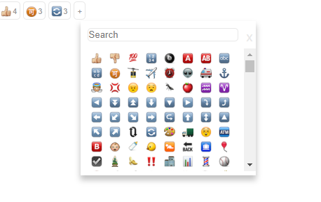

## About
Saves emoji and reaction counts in the database.

Project was inspired by https://github.com/conorhastings/react-emoji-react.

## Screenshots



## Data

Sample data:

```javascript
const emojis = [
  {
    name: 'earth_americas',
    count: 1,
  },
  {
    name: 'eight_pointed_black_star',
    count: 2,
  },
  {
    name: 'envelope',
    count: 1,
  },
];
```
